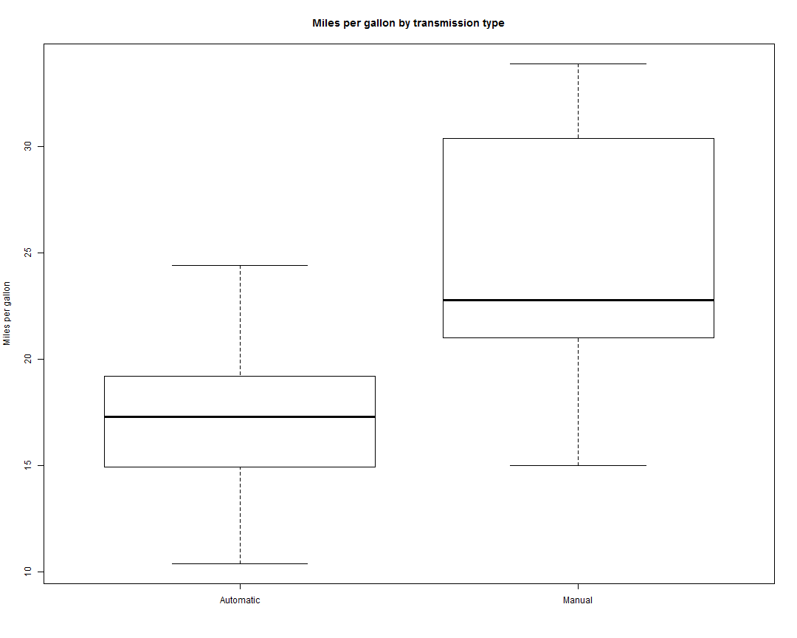

========================================================
author:
date:
autosize: true


# Analysis of mtcars Dataset


## Authored by: Vijayanand


Executive Summary
========================================================


## Analyse cars data to detect if some difference exists between gaz consumption of manual cars, or automatic ones.
## For that, we'll use the data from mtcars which containing 11 measures for 32 cars from the years 73-74. In fact, when the car is light enough (~1000lb), manual transmission is initially at 16.8 mpg which is around 10 more than for automatic ones. However, when the weight increases, there is a decrease of the mpg of (around) -7 for the manual cars, and only -3 for the automatic ones. Thus, starting, with cars more than 3500lb, the automatic cars should be the choice of preference. As a side note, if we had only looked at mean within group we would have always preferred manual cars to automatic, but this is influenced by the fact that the dataset has a few number of lighter cars and all are automatic!
.
.
.
>**GitHub Repository link for the project:**
<https://github.com/vijayanand14/ShinyAppforCars>.


Analysis - Part 1
========================================================

### First of all we're going to load the data, `mtcars`, avaible in R's package `datasets`.
### Then we'll head into to look at what it contains (and adapt the types if necessary).

```
                   mpg cyl disp  hp drat    wt  qsec vs        am gear
Mazda RX4         21.0   6  160 110 3.90 2.620 16.46  0    Manual    4
Mazda RX4 Wag     21.0   6  160 110 3.90 2.875 17.02  0    Manual    4
Datsun 710        22.8   4  108  93 3.85 2.320 18.61  1    Manual    4
Hornet 4 Drive    21.4   6  258 110 3.08 3.215 19.44  1 Automatic    3
Hornet Sportabout 18.7   8  360 175 3.15 3.440 17.02  0 Automatic    3
Valiant           18.1   6  225 105 2.76 3.460 20.22  1 Automatic    3
                  carb
Mazda RX4            4
Mazda RX4 Wag        4
Datsun 710           1
Hornet 4 Drive       1
Hornet Sportabout    2
Valiant              1
```
### So there are 32 observations of cars and 11 measures.

### We're interested in the role playing by the transmission (`am`) in the evolution of miles/gallon consumption (`mpg`). To see a visual interpretation of the relation between the two, a boxplot is available in the appendix. Still visualy, it looks like the difference between the two groups (manual and automatic transmissions) is true, let's see the mean of each first and then perform a between two-groups t-test (assuming normality and independence).


Analysis - Part 2
========================================================


### The difference between both is significant (p-value 0.0013736) and the 95% confidence interval doesn't contains 0, and thus, at this stage, we can say that the manual cars are better than automatic cars from 3.2096842 to 11.2801944 miles per galon. However, using the transmission alone is not enough to quantify the difference for specific cases. To see that, we can look at the prediction of mile per gallon using the single transmission independent variable in a linear regression.

### So the relation between the to is rather clear, with p-value of the change being 2.8502074 &times; 10<sup>-4</sup>. However, the variance explained is quite low, with an `R²` at 0.3597989. So something is missing in the mix.

### In order to find another model explaining better the miles per gallon, we'll use the best model selection since our dataset is quite small. For the sake of sanity, models selected by the stepwise method (forward and backward) have been ran, and they were only diverging at the third variable selecting `hp` or `qsec`. To run these selections, we'll use the useful package `leaps`.


Plot of mtcars dataset
========================================================




